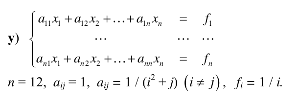
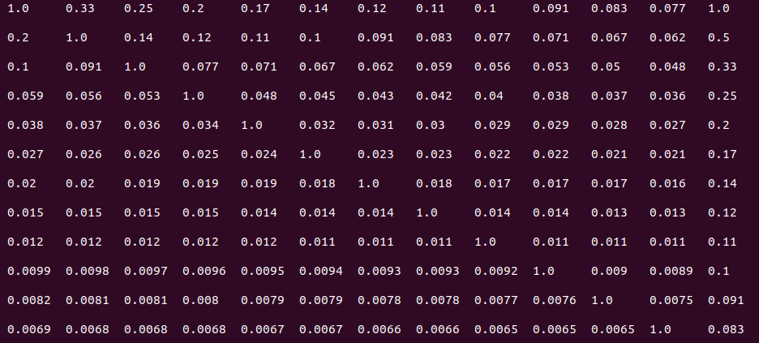
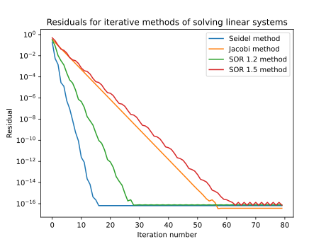

# Linear equations' system solver

In this work we solve system of linear equations using different methods.

To be precise, next methods will be considered:

Direct methods:
+ Gaussian with choosing of main element
+ LU decomposition

Iterative methods:
+ Zeidel
+ Jacoby
+ Successive over relaxation (SOR)

Task matrix is defined in this way:

or in numeric view:

For straight methods residuals close to zero are got:

+ Gaussian method: $5 \cdot 10^{-17}$
+ LU method: $6 \cdot 10^{-17}$

For iterative methods residual depends on iteration number:

This plot shows that with increase of iteration number residual decreases. In different methods it decreases with different speeds. In SOR method it depends on coefficient.
